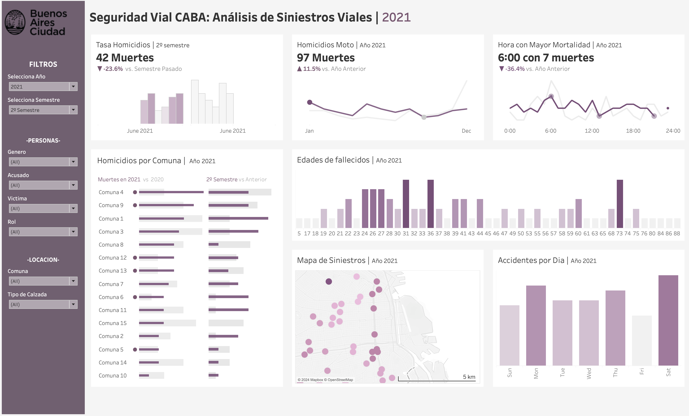

# Proyecto de Análisis de Datos: Reducción de Siniestros Viales en CABA, Argentina.

**Descripción del Problema:**
- Cada año, cerca de 4,000 personas mueren en accidentes de tránsito en Buenos Aires.
- Los accidentes de tránsito son la principal causa de muerte violenta en Argentina.
- La alta densidad de tráfico y población en Buenos Aires agrava la situación.

**Rol a Desarrollar:**
- El Observatorio de Movilidad y Seguridad Vial nos ha proporcionado datos detallados sobre homicidios en accidentes viales (2016-2021).
- Nuestro objetivo es identificar patrones y áreas de intervención para reducir las muertes por accidentes de tránsito.
- Queremos contribuir directamente a la seguridad vial en Buenos Aires mediante la implementación de políticas efectivas.

## Autor

- **Cristian F. Barreto** - *Junior Data Scientist* [@CristianBarreto08](https://github.com/CristianBarreto08) ; cfbn13@hotmail.com

## Tecnologías y Herramientas Utilizadas

- VS Code
- Jupiter Notebooks
- Plotty Express / numpy / Pandas / Seaborn
- Python
- MySQL
- Canvas
- Tableau
- Microsoft Excel
- ChatGPT4 

## Metodología Aplicada

El proyecto sigue los siguientes pasos metodológicos:

**- Extraccion de los datos:** El Observatorio de Movilidad y Seguridad Vial (OMSV), centro de estudios que se encuentra bajo la órbita de la Secretaría de Transporte del Gobierno de la Ciudad Autónoma de Buenos Aires, nos provee con los datos de Siniestros viales entre los años 2016 - 2021.

**- Exploracion y Entendimiento Inicial:** para entender la naturaleza y terminologia de los datos ejecutada en Excel. Contamos con dos Datsets 'Siniestros Fatales' y 'Siniestros con Lesionados'

**- ETL:** en esta fase importamos librerias, ejecutamos procesos de limpieza y nos hicimos cargo de disparidad de los datos, valores nulos, duplicados y outliers. Se tomo la decision de unir los dos datasets dividiendolos segun su gravedad: victimas fatales o lesionados.

**- EDA:** Se realizo un análisis exaustivo en PYTHON, es una etapa crucial en este proyecto de análisis, ya que permitío comprender la naturaleza y características de los datos. Se pudó detectar problemas, formular hipótesis de causas posibles de accidentalidad, validamos suposiciones y nos permitio aislar esos resultados de manera efectiva, lo cual puede permitir guiar de manera efectiva decisiones posteriores para la reduccion de siniestros.

**- Definicion de KPI's:**

    - Reducción del 10% en la tasa de Muertes en siniestros en los últimos seis meses en CABA, en comparación con el semestre anterior. La tasa se calcula como el número de homicidios en siniestros viales por cada 100,000 habitantes.

    - Reducción del 7% en la cantidad de accidentes mortales de motociclistas en el último año en CABA, respecto al año anterior. Este KPI se calcula como el porcentaje de disminución en el número absoluto de accidentes fatales en los que estuvieron involucradas víctimas que viajaban en moto.

    - Reducción del 8% en la cantidad de accidentes mortales por comuna en el último año en CABA, respecto al año anterior. Este KPI se calcula como el porcentaje de disminución en el número absoluto de accidentes fatales en los que estuvieron involucradas víctimas segmentadas en comunas.

**- Dashboard del Análisis de los datos usando Tableau:** con el objetivo de mostrar los KPI's y metricas, integrando el uso de filtros y visualizacion del mapa para reconocer tendencias.

## Demo

## Insights Principales del Análisis 

1. **Distribución del Número de Víctimas:**
   - La mayoría de los siniestros viales registrados involucran a 1 persona como víctima, con más de 2000 registros.
   - El número de casos disminuye considerablemente a medida que aumenta el número de víctimas, con menos de 20 registros para 4 víctimas.

2. **Distribución de Edad de las Víctimas:**
   - Se observa una distribución normal de las edades de las víctimas, sin outliers evidentes.
   - El rango de edad con el mayor número de accidentes fatales se sitúa entre los 20 y los 39 años.

3. **Relación entre número de víctimas y hora del incidente:**
   - Los accidentes fatales son más frecuentes entre las 5:00 AM y las 7:00 AM, coincidiendo con el inicio del día laboral y escolar.
   - Las horas de mayor accidentalidad con víctimas leves o graves ocurren entre las 11:00 AM y las 7:00 PM.

4. **Relación entre número de víctimas y día de la semana:**
   - Los accidentes fatales muestran una distribución relativamente uniforme a lo largo de los días de la semana, con un ligero aumento los viernes, sábados y domingos.
   - Los jueves y viernes presentan una mayor frecuencia de accidentes con víctimas leves o graves.

5. **Distribución de la gravedad por comuna:**
   - La Comuna 1 registra el mayor número de accidentes fatales y con lesionados, seguida por las comunas 4, 7, 8 y 9.
   - La Comuna 6 muestra la menor probabilidad de tener accidentes fatales o con lesionados en comparación con otras comunas de CABA.

6. **Distribución de la gravedad por tipo de calle:**
   - Las avenidas son el tipo de calle con mayor incidencia de accidentes fatales y no fatales, seguidas por las calles y la autopista General Paz.
   - Las autopistas tienen la menor incidencia de accidentes leves.

7. **Relación Entre el Número de Víctimas y el Género:**
   - El 70% de las víctimas en accidentes viales fatales son hombres, mientras que el 67% de las víctimas con lesiones son hombres.
   - Las mujeres tienen una probabilidad menor de estar involucradas en accidentes mortales o con lesiones en comparación con los hombres.

8. **Mapa de Calor de la Densidad de Incidentes por Ubicación:**
   - Se observa una mayor concentración de accidentes graves y fatales en áreas como Monserrat, San Cristóbal y la zona de la Plaza de la Constitución.
   - Las intersecciones con alta actividad vehicular, como el cruce de la Avenida Leandro N. Alem y la Avenida Córdoba, muestran una alta densidad de incidentes leves.

Estos insights proporcionan una visión general de los patrones y tendencias identificados en el análisis de los datos de siniestros viales en la Ciudad de Buenos Aires.

## Conclusiones Y Posibles Soluciones

Recomendaciones basadas en los insights encontrados:

1. **Educación Vial Temprana:**
    *  Implementar programas de educación vial desde una edad temprana para concienciar sobre los riesgos de conducir y fomentar conductas seguras desde la infancia.

2. **Mayor Vigilancia en Horarios Pico:**
   - Incrementar la presencia policial y la vigilancia en las calles durante las horas pico de tráfico, especialmente entre las 5:00 AM y las 7:00 AM, para reducir la incidencia de accidentes fatales al inicio del día.

3. **Refuerzo de Medidas de Seguridad en Avenidas:**
   - Instalar y mantener sistemas de seguridad vial en las avenidas, como señalización clara, semáforos bien sincronizados y pasos peatonales seguros, para reducir la gravedad de los accidentes en estas vías de alta velocidad.

4. **Campañas de Concientización de Género:**
   - Diseñar campañas de concientización específicas dirigidas a hombres, destacando la importancia de respetar las normas de tránsito y conducir de manera responsable para reducir el alto porcentaje de víctimas masculinas en accidentes viales.

5. **Mayor Control en Intersecciones Críticas:**
   - Implementar medidas de control de tráfico más estrictas en intersecciones con alta actividad vehicular, como la intersección de la Avenida Leandro N. Alem y la Avenida Córdoba, mediante la instalación de cámaras de vigilancia y la presencia policial.

6. **Mejora de Infraestructuras en Zonas Críticas:**
   - Realizar mejoras en la infraestructura vial en áreas con alta concentración de accidentes, como Monserrat y San Cristóbal, mediante la ampliación de aceras, la instalación de señalización adicional y la implementación de zonas de tráfico calmado.

7. **Fomento del Uso de Transporte Público:**
   - Promover el uso del transporte público y alternativas de movilidad sostenible para reducir la congestión vehicular y disminuir la probabilidad de accidentes en las horas pico.

8. **Coordinación Interinstitucional:**
   - Establecer una coordinación efectiva entre organismos gubernamentales, fuerzas del orden y organizaciones de la sociedad civil para implementar estrategias integrales de seguridad vial y evaluar su efectividad de manera continua.

Estas conclusiones y posibles soluciones están diseñadas para abordar los principales desafíos identificados en el análisis de los datos de siniestros viales, con el objetivo de mejorar la seguridad vial en la Ciudad de Buenos Aires.

 posibles soluciones basadas en insights extraídos de los datos.

## Estructura del Repositorio

**1. [/Notebooks](Notebooks/):** - Carpeta que contiene los Jupyter Notebooks con el código completo y bien comentado.

   - **ETL:** Extracciones, Transformaciones y Cargas de datos, incluyendo pre-procesamiento y calidad del dato.
   - **EDA:** Análisis Predictivo y Prescriptivo de las variables del conjunto de datos.
   - **KPI:** Especificación técnica del Indicador Clave de Desempeño.
   - **functions:** Código reutilizable de funciones para el ETL y EDA.

**2. [/Datasets](Datasets/)** - Almacena los datasets fuentes y procesados después del ETL y EDA.

-  **[/1. Raw Data](Datasets/1_raw_data/):**
   - *homicidios y lesiones:* Datos originales en formato xlsx.

-  **[/2. Clean Data](Datasets/2_cleaned_data/):**
   - *homicidios_cleaned y lesiones_cleaned:* Archivos limpios resultantes del ETL, en formato csv.
   - *siniestros_viales:* Datos integrados de siniestros viales fatales y no fatales en formato csv.

**3. [/sql_files](sql_files/):** - Scripts .sql utilizados para generar consultas.

**4. [/dashboard](dashboard/):** - Dashboard interactivo "SiniestrosViales" desarrollado en Tableau.

**5. [/assets](assets/):** - Carpeta con imágenes y recursos utilizados durante el proyecto.

## Fuentes de los Datos

- [Registros de Accidentes Fatales en la Ciudad Autonoma de Buenos Aires entre el 2016 al 2021](https://data.buenosaires.gob.ar/dataset/victimas-siniestros-viales)

- [Registros de Accidentes con Lesionados en la Ciudad Autonoma de Buenos Aires entre el 2016 al 2021](https://data.buenosaires.gob.ar/dataset/victimas-siniestros-viales)

- [Senso de Población por Comunas de la Ciudad Autonoma de Buenos Aires entre el 2010 al 2025](https://www.estadisticaciudad.gob.ar/eyc/?p=28146)
